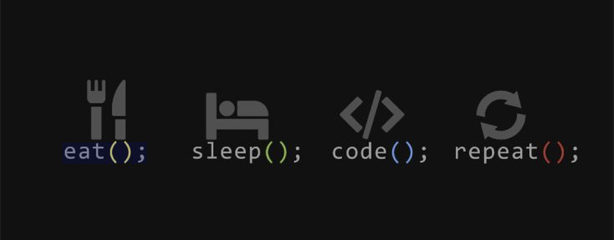

  

 
 

  <H1>Hi, I’m Nouman Gul Junejo.</H1> 

<table>
  <tr>
    <td width="40%">
      
    </td>
    <td valign="top" width="60%">
      

        I’m an <strong>iOS Developer</strong> who’s practically married to <strong>Swift</strong> and has a serious love affair with <strong>SwiftUI</strong>. But don’t get me wrong, I still have a soft spot for <strong>Objective-C</strong>.   
        When I’m not busy making apps that look gorgeous and run like a dream, you’ll find me geeking out over the latest tech trends and frameworks.   
        let’s get to know each other and make some magic happen!
      

    </td>
  </tr>
</table>

### 🔝 Top Contributed Repo

# My Skills  
  
                        
  
**Programming Languages:**  

**Interface:**  

**IDE:** 

**Testing and Debugging:**  

**Architecture Patterns:**  

**Libraries:**  

**Frameworks:**  

**Version Control Systems:**  

# Get in Touch!
Got an awesome idea or a challenging project? Hit me up at  or connect with me on . I am always excited to collaborate on interesting projects or discuss iOS development ideas.
  
Thank you for visiting my GitHub repository.
 
 

  

